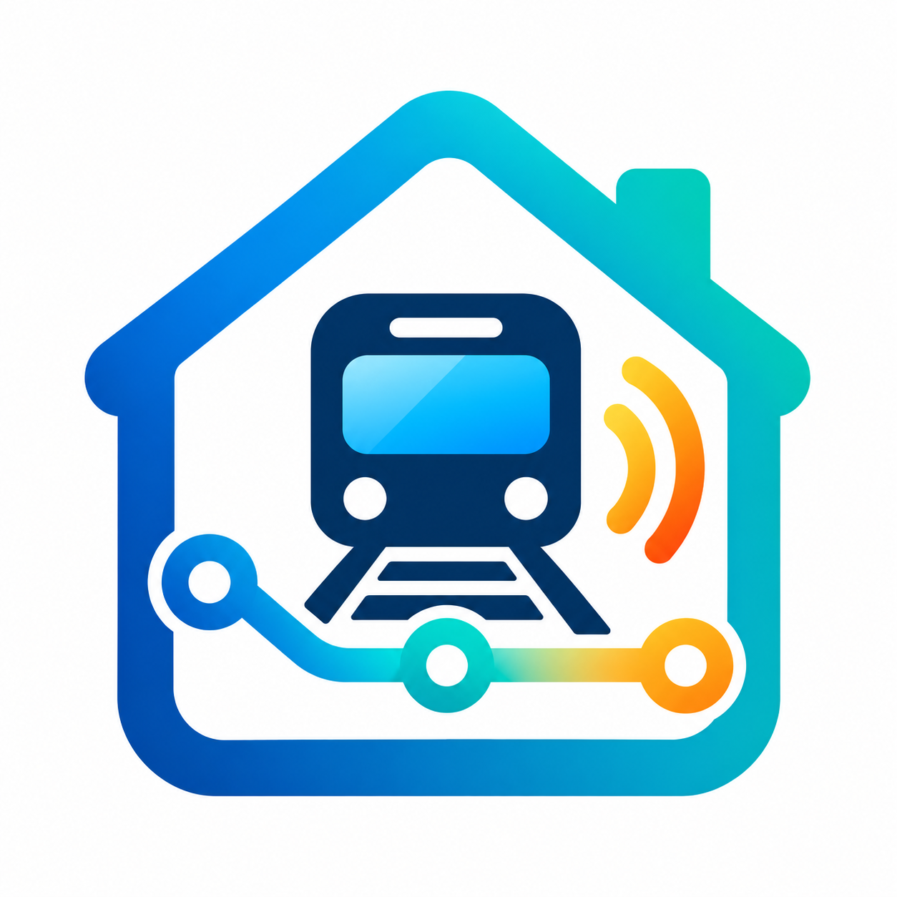

# PTV Line Status for Home Assistant

<p align="center">
  
</p>

Project/repository: `ha-ptv-line-status`

Home Assistant integration: **PTV Line Status** (`ptv_line_status`)

Version 0.2 creates two Home Assistant entities for each configured Metro train
station, line, and direction. Multiple entries can be added, such as
**North Williamstown → City**, **Newport → Williamstown**, and **Newport → City**.

- **Service status** is an enum sensor whose state is `normal`, `delayed`,
  `disrupted`, `suspended`, or `unknown`.
- **Service issue** is a problem binary sensor. It is off for `normal` and on
  for `delayed`, `disrupted`, `suspended`, or `unknown`.

Both entities use the same coordinator data and therefore share one realtime
feed request and polling schedule per configured service.

The integration polls Transport Victoria's Metro GTFS-Realtime Service Alerts
feed and uses explicit GTFS alert effects to classify service. Informational
alerts (including construction alerts that do not explicitly affect train
operation) are exposed only as a count and do not change the sensor state.

## Installation and development

Copy `custom_components/ptv_line_status` into the `custom_components` directory
of a Home Assistant configuration, then restart Home Assistant. For development,
mount or copy this repository into a Home Assistant development environment and
run the tests with `pytest` from the repository root. External API calls are
mocked by the tests; no development API key is required.

The runtime dependency `gtfs-realtime-bindings==2.2.0` is declared in
`manifest.json` and Home Assistant installs it when loading the integration.

## Configuration

In Home Assistant, go to **Settings → Devices & services → Add integration**,
select **PTV Line Status**, enter a Transport Victoria Open Data API key,
then choose a Metro station and direction. A line-selection step appears when a
station is served by multiple lines. Direction labels come from published GTFS
trip destinations rather than the numeric GTFS `direction_id`.

The API key is validated against the Service Alerts endpoint. The static Metro
GTFS Schedule is downloaded during configuration and cached in memory for reuse
by further config flows. The large schedule and its raw tables are not stored in
the config entry. Only resolved IDs and human-readable names are saved. The key
is not logged or exposed in sensor attributes. YAML is not supported.

Existing v0.1 North Williamstown entries are migrated automatically to the new
mapping fields while retaining their API key, entry identity, and unique ID.

### Upgrading from the former `ptv` domain

The integration was renamed to the `ptv_line_status` domain. Home Assistant does
not provide a supported way for a custom integration to transfer config entries
between domains. Remove entries belonging to the former **Transport Victoria**
integration, remove the old `custom_components/ptv` directory, install
`custom_components/ptv_line_status`, restart Home Assistant, and add the desired
services again through **PTV Line Status**. Do not edit Home Assistant `.storage`
files.

The entity unique-ID algorithms have not otherwise changed. Re-adding an entry
creates a new Home Assistant config-entry ID, so entity-registry IDs and history
from the former domain cannot be guaranteed to attach automatically.

## Polling and updates

The feed is fetched every 60 seconds while the integration has listeners. This
is a practical balance for a realtime alert feed and amounts to at most about
1,440 requests per day for this config entry. Transport Victoria's exact quota
is not encoded here; the interval can be revisited if published feed guidance
or rate-limit headers establish a better value.

Authentication failures trigger Home Assistant's authentication-failure path.
Network, HTTP, and malformed protobuf failures mark coordinator data unavailable
and retain Home Assistant's normal retry behavior.

## Troubleshooting

To enable diagnostic logging, add this to your Home Assistant configuration:

```yaml
logger:
  logs:
    custom_components.ptv_line_status: debug
```

Debug logs must never contain the API key. Failures include the feed and fixed
endpoint host/path, HTTP status/reason and content type when available. Only
allowlisted correlation/request IDs and rate-limit `Retry-After` values are
included. Text/JSON/XML HTTP error excerpts are sanitised, normalised and limited
to 200 characters; request headers and raw transport exceptions are not logged.
Review logs before sharing them, since upstream error text can contain other
server-provided information.

HTTP 401/403 triggers reauthentication, but does not prove the key has expired:
a gateway or authentication-service outage can produce the same response. Retry
the unchanged key once the upstream service recovers. HTTP 429, 5xx, timeout and
connection failures remain temporary update failures. Empty responses, unexpected
content types and invalid protobuf are data failures. The normal 60-second polling
interval is unchanged; `Retry-After` is reported for diagnosis, not used to alter it.
Home Assistant's coordinator logs unavailability and recovery without repeating
the same error on every poll. Config-flow screens show concise translated errors,
not server response text; safe validation details are available at debug level.

## Known limitations

- Metro trains only; buses, trams, regional trains, and replacement buses are
  excluded.
- Static GTFS is cached only for the current Home Assistant process. The first
  new configuration after a restart downloads the current weekly schedule.
- There is no departure-time data, nearby-stop support, dashboard, automation,
  or HACS packaging.
- Classification is deliberately conservative and based on explicit GTFS-RT
  effects, not keywords in alert titles or descriptions.
- Operational alert attributes contain compact summaries rather than complete
  GTFS-Realtime payloads.
